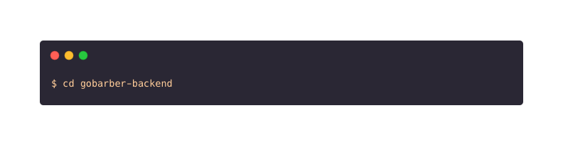
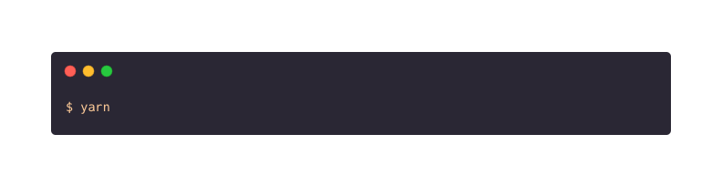

<h1 align="center">GoBarber</h1>

<h3 align="center"> This is a study project about beauty service scheduling :books:</h3>

## :star: Features

This project features all the latest tools and practices in back-end development!

- 💹 **NodeJS** — An open source event-oriented asynchronous JavaScript interpreter
- :elephant: **PostgreSQL** — A relational object database manager system
- :leaves: **MongoDB** — A cross-platform and open-source document-oriented database
- :closed_book: **Redis** — An open source networked database that stores keys with optional accessories

## :electric_plug: Getting started

1. Clone this repo using:

2. Move yourself to the appropriate directory:

3. Run `yarn` to install dependencies

